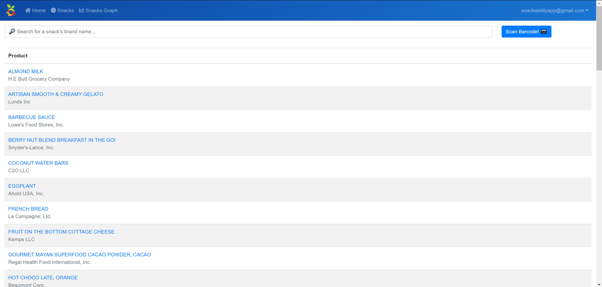
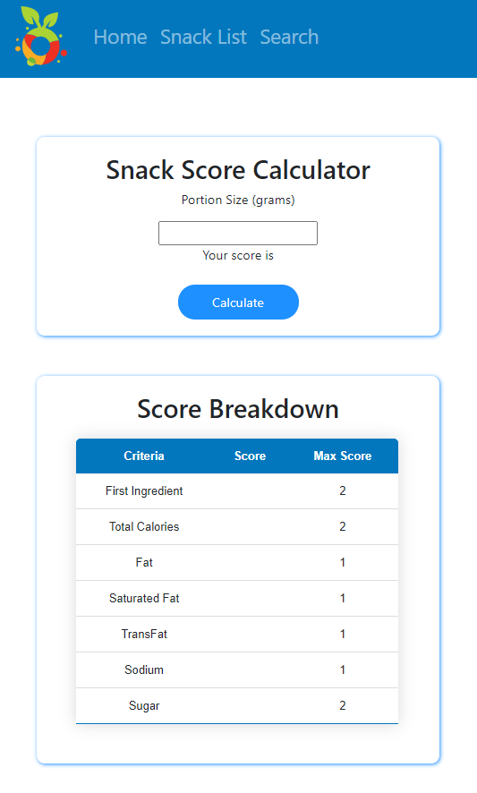

  

<h1 align=center>S N A C K A B I L I T Y</h1>

## About
The goal of the Snackability app is to help you identify healthy snacks by providing a score from 0 (not healthy) to 10 (very healthy) to each snack searched in our app.
The Web Application is a current work in progress translation of the mobile application onto a website accessible application.

## Utilization

The user is capable of searching for a "snack" that ranges from chips, cookies, pasteries to sweets, fruits, legumes; querying from a Firebase DB. 
The query results show the user basic nutritional information of the snack and allows the user to click a "calculate" button to move to a scoring page.

The scoring page then allows the user to receive a score for consumption of the snack as well as display a score breakdown.

